# tournament_maker アーキテクチャ解説

## 全体パイプライン

`.render()` を呼ぶと3段パイプラインが実行される。

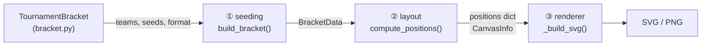

各段の責務を一言で：

| 段 | ファイル | 入力 | 出力 | 責務 |
|----|----------|------|------|------|
| ① | `seeding.py` | チームリスト・シード・形式 | `BracketData` | **誰が誰と戦うか**を決める |
| ② | `layout.py` | `BracketData` + `StyleOptions` | `dict[int, MatchPos]` + `CanvasInfo` | **どこに描くか**を決める（ピクセル座標） |
| ③ | `renderer.py` | 上記すべて | SVG要素 | **実際に描く** |

---

## ① seeding.py — マッチツリーの構築

### データモデル

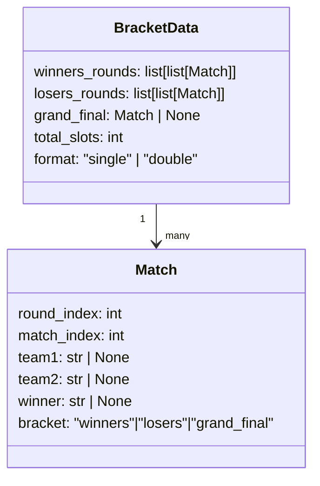

### スロット配置（チーム数が2の累乗でない場合）

8チームのトーナメントに5チームが参加する例：

```
チーム数 5 → 次の2の累乗 = 8 → 不戦勝（BYE）が必要な数 = 3
シード3名が必要
```

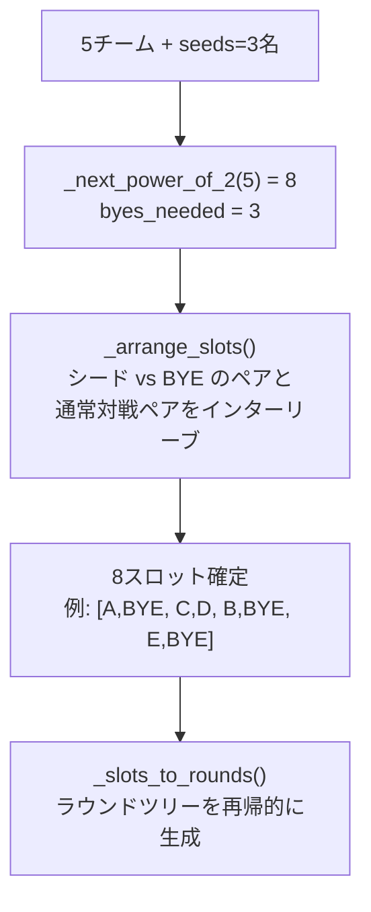

**インターリーブ（Bresenham式）** — BYEペアと通常ペアを均等に分散する：

```
bye_pairs  = [(A,BYE), (B,BYE), (C,BYE)]   ← シード3名
real_pairs = [(D,E)]                         ← 残り2名のペア

インターリーブ後: [(A,BYE), (D,E), (B,BYE), (C,BYE)]
```

### ラウンドツリーの構造

シングルエリミネーション8チームの例：

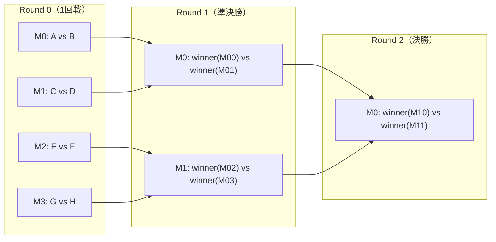

### ダブルエリミネーションの構造

WBの各ラウンドで敗者をLBに送り込む。LBは「intake（WB敗者受け入れ）」と「intra-LB（内部削減）」が交互に並ぶ。

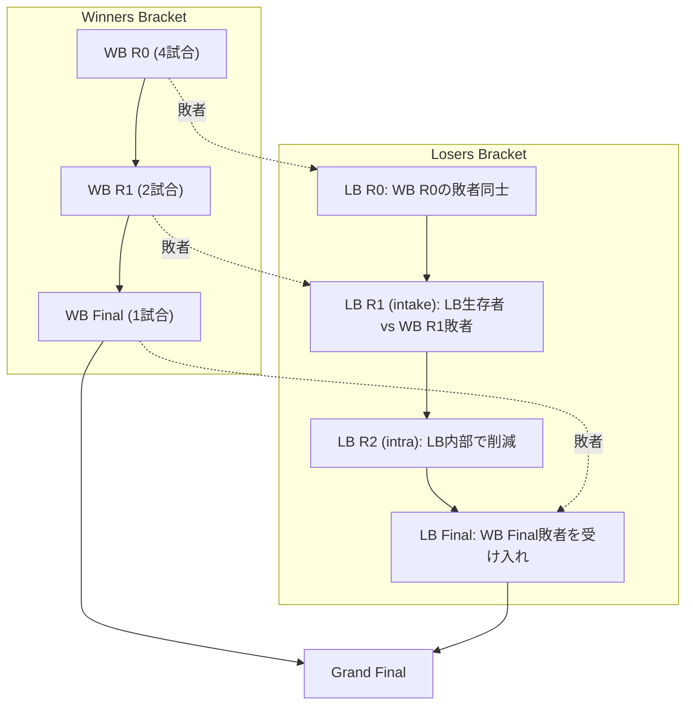

---

## ② layout.py — ピクセル座標の計算

### MatchPos — 1試合の座標

すべての座標は「**論理LTR空間**」で計算される。top_to_bottomのようなレイアウトでは、レンダラー側がx↔yを入れ替えて読む（layout.pyは常にLTR前提で計算する）。

```
       pos.x   pos.conn_x
         │          │
 ────────┼──────────┼──── pos.y1 （team1の中心y）
         │[name box]│
         │          │─── pos.result_y = (y1+y2)/2
         │[name box]│
 ────────┼──────────┼──── pos.y2 （team2の中心y）
         │          │
         ←─box_width─→
```

```python
@dataclass
class MatchPos:
    x: float        # name boxの左端x
    y1: float       # team1の中心y
    y2: float       # team2の中心y
    conn_x: float   # x + box_width（アームの起点）
    result_y: float # (y1+y2)/2（次ラウンドへの入力y）
    mirrored: bool  # True = RTL描画（face_to_face右側）
```

### col_width — 列幅の定義

```
←──────── col_width ──────────→
←── box_width ──→←connector_len→
┌─────────────────┐             :
│   name box      ├──arm──┤     :  ← 垂直コネクタ
└─────────────────┘        :   :
                            └─result line→
```

`col_width = box_width + connector_length`

`arm_length` は `connector_length` の内側に含まれる（box右端からarmの先端まで）。

### 座標の決まり方（シングルエリミネーション LTR）

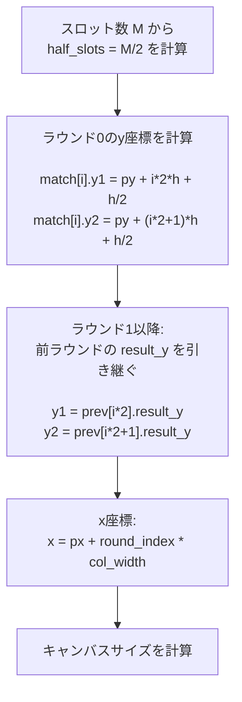

具体例（8チーム、デフォルトスタイル）：

```
box_width=160, connector_length=60, arm_length=20
col_width = 220, padding_left=20, slot_height=40

Round 0, Match 0 (A vs B):
  x=20, conn_x=180
  y1 = 20 + 0*40 + 20 = 40
  y2 = 20 + 1*40 + 20 = 80
  result_y = 60

Round 0, Match 1 (C vs D):
  x=20
  y1=120, y2=160, result_y=140

Round 1, Match 0 (SF):
  x = 20 + 1*220 = 240
  y1 = 60  ← R0.M0.result_y
  y2 = 140 ← R0.M1.result_y
  result_y = 100

Round 2, Final:
  x = 20 + 2*220 = 480
  y1 = 100 ← R1.M0.result_y
  ...
```

### positions辞書のキーは id(match)

```python
positions: dict[int, MatchPos]
# キーは id(match)（Pythonオブジェクトのメモリアドレス）
# インデックスではない！
```

**なぜ id(match) を使うか：** seeding → layout → renderer の3段で同じ `Match` オブジェクトを使い回すため。ラウンドインデックスだとダブルエリミネーションのWB/LBで重複する。

---

## レイアウト方向ごとの変換

### direction 一覧

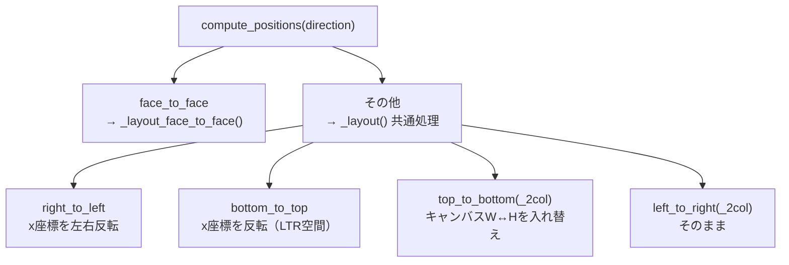

### top_to_bottom の座標変換

TTBではlayout.pyは「LTR空間」で計算したまま、キャンバスのW↔Hを入れ替えてレンダラーに渡す。レンダラーが `pos.x` をSVGのy軸、`pos.y1/y2` をSVGのx軸として読む。

```
LTR空間（layout.py出力）   TTBレンダラーの読み替え
  pos.x     → SVG y（ラウンドの深さ方向）
  pos.conn_x → SVG y（ボックス下端）
  pos.y1    → SVG x（チーム1の列）
  pos.y2    → SVG x（チーム2の列）
```

### face_to_face の特殊処理

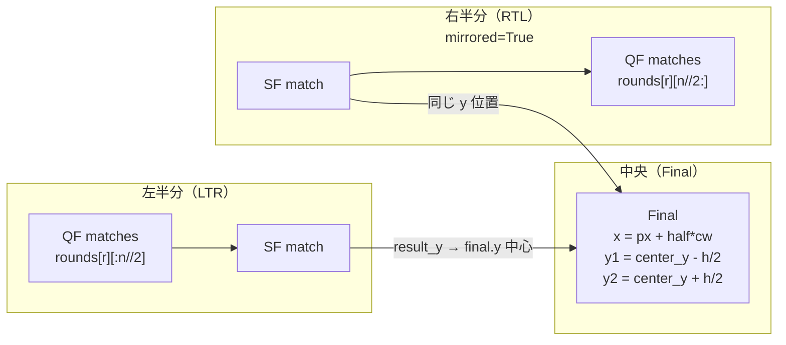

右半分が左半分と**同じ y スロット**を使うことで、両SFの `result_y` が揃い、水平線1本で繋がる。

---

## ③ renderer.py — SVG要素の生成

### 1試合の描画（LTR水平）

```
pos.x    conn_x  arm_x           result_end_x
  │         │      │                    │
  ┌─────────┐      │                    │
  │ team1   ├──────┤                    │
  └─────────┘      │ ← 垂直コネクタバー  │
                   ├────────────────────→ result line
  ┌─────────┐      │
  │ team2   ├──────┘
  └─────────┘

arm_x        = conn_x + arm_length
result_end_x = conn_x + connector_length  (= 次ラウンドの x)
```

### _match_h の描画ロジック

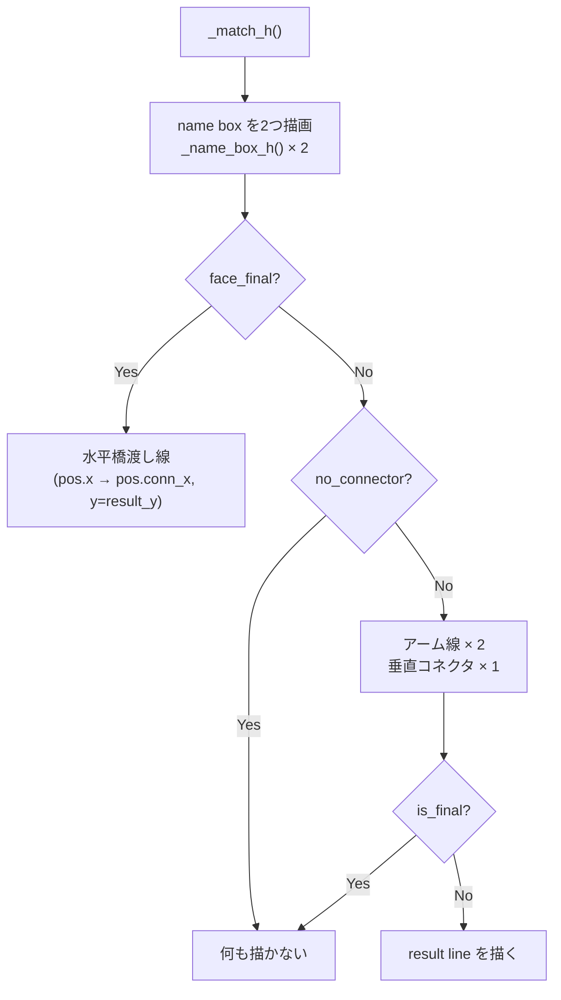

### name box の3モード

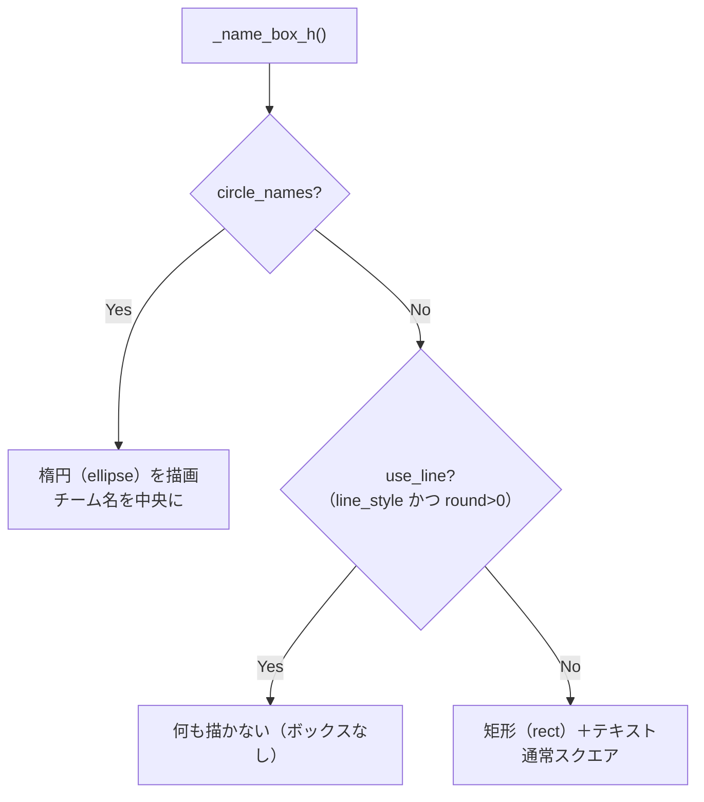

### is_rtl（RTL）の処理

`mirrored=True`（face_to_face右半分）か `direction=right_to_left` のとき `eff_rtl=True` になる。

```python
# LTR
arm_x        = pos.conn_x + arm_length      # 右に出る
result_end_x = pos.conn_x + connector_length

# RTL（is_rtl=True）
arm_x        = pos.x - arm_length           # 左に出る
result_end_x = pos.x - connector_length
```

---

## スタイルオプション一覧

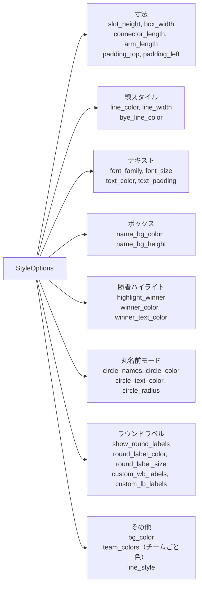

---

## 拡張ガイド

### 新しいレイアウト方向を追加する

1. `bracket.py` の `valid` セットに名前を追加
2. `layout.py` の `compute_positions()` に分岐を追加
3. 既存の `_layout()` を流用するか、`_layout_face_to_face()` のように専用関数を書く

```python
# layout.py
def compute_positions(bracket, style, direction):
    if direction == "my_new_layout":
        return _layout_my_new(bracket, style)   # ← 追加
    if direction == "face_to_face":
        ...
```

必要な出力は `dict[int, MatchPos]` と `CanvasInfo` の2つだけ。

### 新しいボックス描画スタイルを追加する

`renderer.py` の `_name_box_h()` または `_name_box_v()` を拡張する。

```python
def _name_box_h(dwg, x, y, bw, name, style, highlight, is_bye, is_rtl, use_line):
    if style.circle_names:
        ...           # 既存: 楕円
    elif use_line:
        pass          # 既存: 何も描かない
    elif style.MY_NEW_STYLE:   # ← 追加
        ...           # 新スタイル
    else:
        ...           # 既存: 矩形
```

`StyleOptions` に対応するフィールドを追加するだけで有効になる。

### 新しい試合接続スタイルを追加する

`_match_h()` の分岐に追加する。

```python
if face_final:
    ...
elif my_new_connector:    # ← 追加
    ...
elif not no_connector:
    ...  # 通常アーム
```

### ダブルエリミネーションのLBラウンド数

8チームの場合、LBは6ラウンドになる：

```
LB R0 (intake R0のペア) → LB R1 (WB R1敗者) → LB R2 (intra)
→ LB R3 (WB Final敗者) → LB Final
```

`_build_losers_bracket()` は `wb_rounds` の長さから自動的にラウンド数を計算する。新しいフォーマット（例: triple elimination）を追加するなら `seeding.py` に同様の関数を追加し、`BracketData` のフィールドを拡張する。

---

## 不変条件

1. **`id(match)` はパイプライン全体で一意のキー** — seeding で生成した `Match` オブジェクトをそのまま layout → renderer に渡す。途中で `Match` を再生成すると `id()` が変わってクラッシュする。

2. **`round_index` はラウンド内でのみ有効** — WBとLBで重複するため、ラウンドをまたぐ参照には `id(match)` を使う。

3. **LTR空間で計算** — `layout.py` は常にLTR座標を出力する。TTB/BTTへの変換はキャンバスW↔Hの入れ替えとレンダラー側の軸読み替えで実現する。layout.py自体は方向を意識しない。
